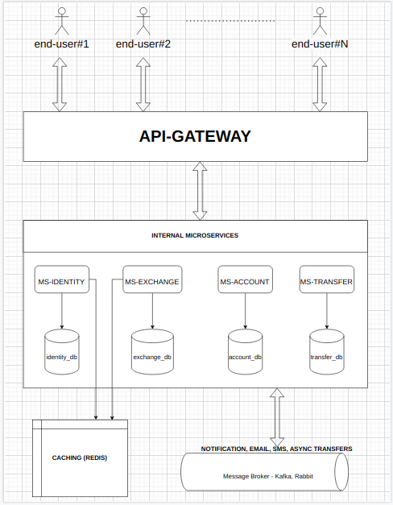
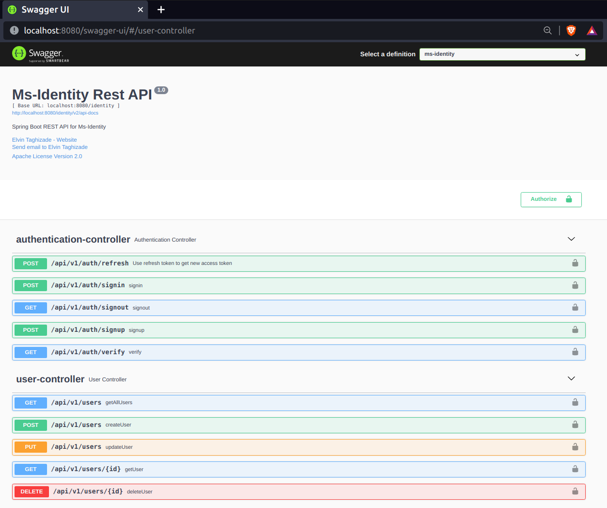
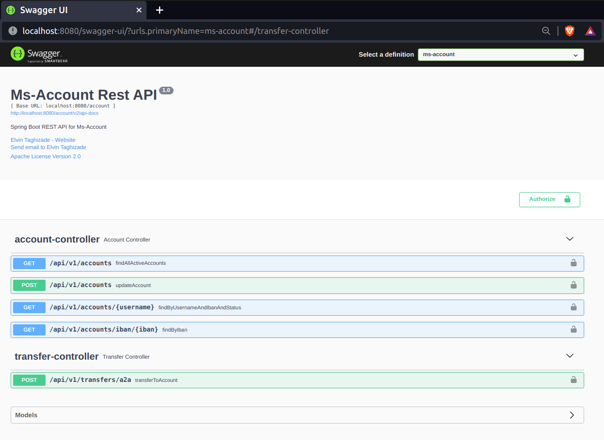
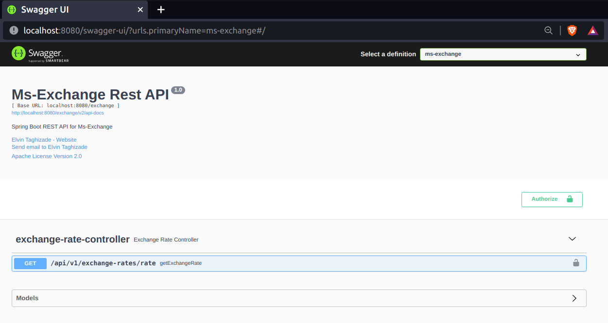

# Uni-Tech Digital Banking System Demo #


<pre>
Total test count:  152
Used:
    - Java 11, Gradle
    - Spring Boot -> Web, AOP, Security(JWT), Data JPA, Test, ArchTest, Validation
    - Spring Cloud Gateway
    - OpenFeign (for exchange rates service from `https://api.exchangerate.host/latest`
    - Redis
    - Postgres db, h2 db (only for testing)
    - Liquibase as db migration tool
    - DockerFile, Docker Compose
    - Project Lombok
    - MapStruct
    - Spring Fox (Swagger)
    - Slf4j
    - Sonarqube
    - Checkstyle
</pre>

## API Gateway ##

- Spring Cloud Gateway

## Getting Started ##
Open terminal and:
- `git clone https://github.com/elvint14/uni-tech.git` - clone the project
- `cd ./uni-tech` - cnange directory into the project
- `chmod +x start.sh` - add permission to `start.sh` file to be able to run command inside it
- `chmod +x gradlew`  - add permission to `gradlew` file to be able to clean and build
- `./start.sh` - start app
- `./stop.sh`  - stop app

## Architecture ##



## Swagger Docs: ##

```
http://localhost:8080/swagger-ui/
```

### Ms-Identity Rest API ###



### Ms-Account Rest API ###



### Ms-Exchange Rest API ###


